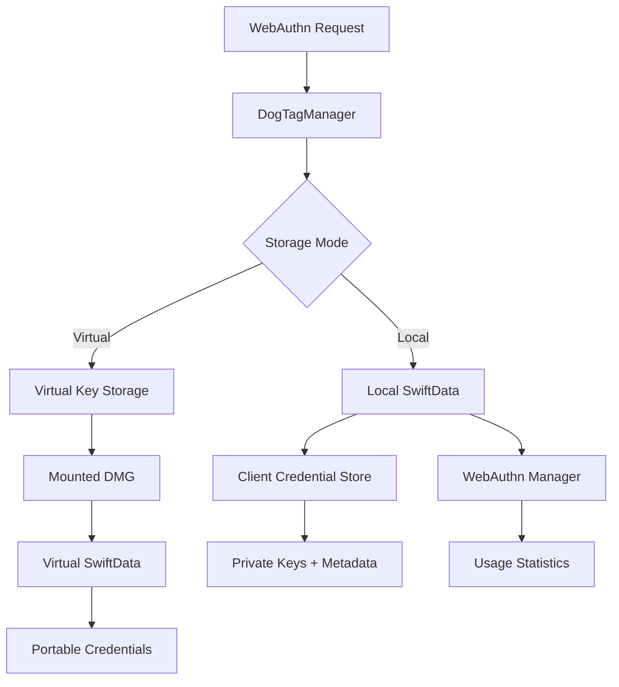

# 🐶🏷️ DogTagClient

<div align="center">

**A powerful Swift package for WebAuthn/FIDO2 credential management on macOS**

[](https://swift.org)
[](https://developer.apple.com/macos/)
[](https://developer.apple.com/documentation/swiftdata)
[](https://fidoalliance.org)

*Transform your macOS app into a WebAuthn powerhouse with native Touch ID support, virtual hardware keys, and comprehensive credential management.*

</div>

## 🚀 Features

### 🔐 **WebAuthn/FIDO2 Core**
- **Native WebAuthn Implementation**: Full FIDO2/WebAuthn support with macOS integration
- **JavaScript Bridge**: Seamlessly override browser WebAuthn APIs with native implementations
- **Touch ID Integration**: Secure biometric authentication using LocalAuthentication framework
- **CBOR/COSE Support**: Complete CBOR decoding and COSE key handling
- **Signature Counter Tracking**: Advanced usage analytics and replay attack prevention

### 🗄️ **Credential Management**
- **SwiftData Backend**: Modern, type-safe database with automatic persistence
- **Client & Server Stores**: Dual storage architecture for comprehensive credential tracking
- **Real-time Sync**: Automatic synchronization between storage layers
- **Advanced Search & Filtering**: Find credentials by username, domain, or display name
- **Bulk Operations**: Export, import, and manage multiple credentials efficiently

### 💾 **Virtual Hardware Keys**
- **Portable Credential Storage**: Create encrypted disk images (.dmg) containing credentials
- **AES-256 Encryption**: Optional password protection for virtual keys
- **Cross-Device Transfer**: Move credentials between systems using encrypted disk images
- **Database Compatibility**: Uses identical SwiftData schema as main storage
- **Automatic Mount/Unmount**: Seamless disk image handling with macOS native tools

### 🔍 **Analysis & Debugging**
- **FIDO2 Protocol Analysis**: Deep inspection of authenticator data and attestation objects
- **CBOR Decoder**: Visualize COSE keys and attestation data in human-readable format
- **Cryptographic Details**: Public key analysis, algorithm identification, and security assessment
- **Usage Statistics**: Track credential usage patterns and security metrics
- **Risk Assessment**: Automated security evaluation and compliance checking

### 🎨 **Modern SwiftUI Interface**
- **Tabbed Management**: Intuitive interface for credentials, virtual keys, and preferences
- **Live Updates**: Real-time credential usage tracking with notifications
- **Export Workflows**: Drag-and-drop credential export to virtual keys
- **System Integration**: Native macOS look and feel with modern design patterns

## 📦 Installation

### Swift Package Manager

Add DogTagClient to your project using Xcode or by adding it to your `Package.swift` file:

```swift
dependencies: [
    .package(url: "https://github.com/yourusername/DogTagClient.git", from: "1.0.0")
]
```

### Requirements

- **macOS 12.0+** (Required for CoreData [Not fully tested, YMMV] and modern LocalAuthentication APIs)
- **Swift 5.9+** (Required for modern Swift features)
- **Xcode 15.0+** (For SwiftData support)
  

## 🏃‍♂️ Quick Start

### 1. Basic Setup

```swift
import SwiftUI
import DogTagClient

@main
struct MyApp: App {
    var body: some Scene {
        WindowGroup {
            DogTagManager() // Complete credential management interface
                .frame(minWidth: 800, minHeight: 600)
        }
    }
}
```

### 2. WebAuthn JavaScript Integration

```swift
import WebKit
import DogTagClient

class MyWebView: WKWebView {
    override init(frame: CGRect, configuration: WKWebViewConfiguration) {
        // Inject WebAuthn native bridge
        let userScript = WKUserScript(
            source: webAuthnScript, // Provided by DogTagClient
            injectionTime: .atDocumentStart,
            forMainFrameOnly: false
        )
        
        configuration.userContentController.addUserScript(userScript)
        
        super.init(frame: frame, configuration: configuration)
    }
}
```

### 3. Credential Management

```swift
import DogTagClient

// Get the shared storage manager
let storageManager = VirtualKeyStorageManager.shared

// List all credentials
let credentials = storageManager.getAllClientCredentials()
print("Found \(credentials.count) credentials")

// Get credential usage statistics
let credentialStore = storageManager.getClientCredentialStore()
let signCount = credentialStore.getSignCount(for: "credential-id-here")
print("Credential used \(signCount ?? 0) times")
```

### 4. Virtual Hardware Keys

```swift
import DogTagClient

// Create a virtual hardware key
let config = VirtualKeyConfiguration(
    name: "MyPortableKey",
    sizeInMB: 50,
    password: "securePassword123"
)

do {
    let virtualKey = try await VirtualHardwareKeyManager.shared.createVirtualKey(config: config)
    print("Created virtual key: \(virtualKey.name)")
    
    // Export credentials to virtual key
    let exportedCount = try await VirtualHardwareKeyManager.shared.exportCredentialsToVirtualKey(
        keyId: virtualKey.id,
        credentialIds: ["credential1", "credential2"],
        password: "securePassword123"
    )
    print("Exported \(exportedCount) credentials")
    
} catch {
    print("Failed to create virtual key: \(error)")
}
```

## 📖 Detailed Usage

### WebAuthn Integration

DogTagClient provides a complete WebAuthn implementation that can replace browser-based WebAuthn APIs:

```swift
// The webAuthnScript constant provides JavaScript that overrides
// navigator.credentials.create() and navigator.credentials.get()
// to use native macOS implementations

// Example: Override WebAuthn in a WKWebView
let webView = WKWebView()
let userScript = WKUserScript(
    source: webAuthnScript,
    injectionTime: .atDocumentStart,
    forMainFrameOnly: false
)
webView.configuration.userContentController.addUserScript(userScript)
```

### Storage Architecture

DogTagClient uses a dual-storage architecture:

```swift
// Client-side storage (with private keys)
let clientStore = storageManager.getClientCredentialStore()
let clientCredentials = clientStore.getAllCredentials()

// Server-side storage (metadata only)
let webAuthnManager = storageManager.getWebAuthnManager()
let serverCredentials = webAuthnManager.getAllUsers()

// Sync between stores
storageManager.syncCredentialsAcrossStores()
```

### Virtual Key Management

Virtual keys are encrypted disk images that contain portable credential databases:

```swift
// List available virtual keys
let virtualKeys = try await VirtualHardwareKeyManager.shared.listVirtualKeys()

// Create new virtual key with encryption
let config = VirtualKeyConfiguration(
    name: "ProductionKeys",
    sizeInMB: 100,
    password: "your-secure-password",
    fileSystemType: "HFS+"
)

let virtualKey = try await VirtualHardwareKeyManager.shared.createVirtualKey(config: config)

// Import credentials from virtual key
let importedCount = try await VirtualHardwareKeyManager.shared.importCredentialsFromVirtualKey(
    keyId: virtualKey.id,
    password: "your-secure-password",
    overwriteExisting: false
)
```

### Security Features

#### Touch ID Integration

```swift
import DogTagClient

// Touch ID authentication is automatically integrated
// Credentials are protected by LocalAuthentication framework
let authService = LocalAuthService.shared

// Diagnose credential availability for a specific domain
authService.diagnoseCredentialAvailability(for: "https://example.com")
```

#### Encryption Details

- **Private Keys**: Encrypted using device keychain with Touch ID protection
- **Virtual Keys**: AES-256 encrypted disk images with password protection
- **Database**: SwiftData provides automatic encryption at rest
- **CBOR Data**: Secure CBOR/COSE handling with validation

### Advanced Features

#### FIDO2 Analysis

```swift
// Get detailed FIDO2 protocol information
let credential = // ... get credential from storage
let publicKeyInfo = PublicKeyInfo.from(data: credential.publicKey)

print("Algorithm: \(publicKeyInfo.algorithm)")
print("Curve: \(publicKeyInfo.curve)")
print("Fingerprint: \(publicKeyInfo.fingerprint)")
```

#### Real-time Notifications

```swift
// Listen for credential usage events
NotificationCenter.default.addObserver(
    forName: .webAuthnCredentialUsed,
    object: nil,
    queue: .main
) { notification in
    if let credentialId = notification.userInfo?["credentialId"] as? String {
        print("Credential used: \(credentialId)")
        // Refresh UI, update statistics, etc.
    }
}
```

## 🏗️ Architecture

### Core Components

```
DogTagClient/
├── DogTagClient.swift              # WebAuthn JavaScript bridge
├── DogTagManager.swift             # Main SwiftUI interface
├── VirtualHardwareKeyManager.swift # Virtual key management
├── WebAuthnManager.swift           # Core WebAuthn implementation
├── LocalAuthService.swift          # Touch ID integration
├── KeyStoragePreferences.swift     # User preferences
└── Supporting Files/
    ├── WebAuthnTypes.swift         # Type definitions
    ├── WebAuthnDelegates.swift     # Protocol implementations
    ├── VirtualKeyStorageManager.swift # Storage coordination
    └── Utilities/                  # Helper classes and extensions
```

### Storage Flow



## 🎯 Use Cases

### 1. **Enterprise WebAuthn Deployment**
```swift
// Deploy WebAuthn across macOS fleet with centralized management
let enterprise = DogTagManager()
// Credentials automatically sync with existing infrastructure
```

### 2. **Developer Testing Environment**
```swift
// Create isolated test credentials for WebAuthn development
let testConfig = VirtualKeyConfiguration(name: "TestEnvironment", sizeInMB: 25)
let testKey = try await VirtualHardwareKeyManager.shared.createVirtualKey(config: testConfig)
```

### 3. **Secure Credential Backup**
```swift
// Export production credentials to encrypted virtual keys
let backupKey = try await VirtualHardwareKeyManager.shared.createVirtualKey(
    config: VirtualKeyConfiguration(name: "Backup-\(Date())", password: strongPassword)
)
```

### 4. **Cross-Device Credential Transfer**
```swift
// Move credentials between development machines
let portableKey = try await VirtualHardwareKeyManager.shared.createVirtualKey(
    config: VirtualKeyConfiguration(name: "Portable", sizeInMB: 50, password: "transfer-key")
)
```

## 🔧 Configuration

### Storage Preferences

```swift
// Configure storage behavior
let preferences = KeyStoragePreferences()
preferences.defaultStorageMode = .virtual // or .local
preferences.autoSyncInterval = 30 // seconds
preferences.maxConcurrentOperations = 3
```

### Security Settings

```swift
// Configure authentication requirements
let authConfig = LocalAuthenticationConfiguration()
authConfig.requireBiometrics = true
authConfig.fallbackToPassword = false
authConfig.cacheTimeout = 300 // 5 minutes
```

## 🚨 Security Considerations

### Best Practices

1. **Private Key Protection**: Private keys are automatically encrypted and stored in the macOS Keychain
2. **Virtual Key Passwords**: Use strong, unique passwords for virtual key encryption
3. **Access Control**: Touch ID provides an additional security layer
4. **Regular Rotation**: Monitor credential age and rotate old credentials
5. **Audit Trails**: Track credential usage patterns for anomaly detection

### Threat Model

- **Credential Theft**: Private keys are hardware-bound and encrypted
- **Replay Attacks**: Signature counters prevent credential reuse
- **Physical Access**: Touch ID and encryption protect against device compromise
- **Network Interception**: FIDO2 protocol provides end-to-end security

## 🧪 Testing

### Unit Tests

```bash
# Run the test suite
swift test

# Run specific test targets
swift test --filter DogTagClientTests
swift test --filter VirtualHardwareKeyTests
```

### Integration Testing

```swift
// Test WebAuthn flow end-to-end
let testManager = DogTagManager()
// Simulate credential creation, usage, and management
```

## 🤝 Contributing

We welcome contributions! Please see our [Contributing Guidelines](CONTRIBUTING.md) for details.

### Development Setup

1. Clone the repository
2. Open `WebMan.xcodeproj` in Xcode
3. Build and run the project
4. Make your changes and submit a pull request

### Code Style

- Follow Swift API Design Guidelines
- Use SwiftUI best practices
- Include comprehensive documentation
- Add unit tests for new features

## 📝 License

This project is licensed under the MIT License - see the [LICENSE](LICENSE) file for details.

## 🙏 Acknowledgments

- **FIDO Alliance** for the WebAuthn/FIDO2 specifications
- **Apple** for SwiftData, LocalAuthentication, and macOS security frameworks
- **Swift Community** for excellent tooling and ecosystem support

## 📚 Additional Resources

- [WebAuthn Specification](https://w3c.github.io/webauthn/)
- [FIDO2 Developer Guide](https://fidoalliance.org/developer-resources/)
- [SwiftData Documentation](https://developer.apple.com/documentation/swiftdata)
- [Virtual Keys README](VIRTUAL_KEYS_README.md) - Detailed virtual key documentation

---

<div align="center">

**Made with ❤️ for the WebAuthn community**

[Report Issues](https://github.com/yourusername/DogTagClient/issues) • [Feature Requests](https://github.com/yourusername/DogTagClient/discussions) • [Documentation](https://github.com/yourusername/DogTagClient/wiki)

</div> 
